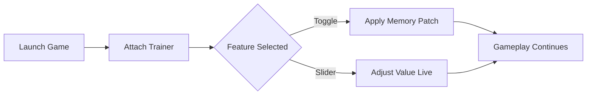

# Fourteen Years of Flames Trainer

There are games that feel like embers—quiet, glowing, patient—and then there are those that burn for years, leaving ash and memory behind. **Fourteen Years of Flames** belongs to the latter. And when the fire runs too hot, a careful hand can shape the blaze.

The **Fourteen Years of Flames Trainer** is a focused PC control tool designed to give players flexible authority over gameplay systems without breaking immersion. Not a blunt hammer, but a set of tuning forks—each one resonating with balance, experimentation, and flow.

> This trainer is built for players who want to *understand* the game more deeply, not simply rush past it.

---

## 🌋 Overview

The trainer integrates directly with **Fourteen Years of Flames**, allowing real-time adjustments while the game is running. Instead of rigid presets, it emphasizes modular toggles and adjustable values—letting you adapt moment by moment.

Whether you’re revisiting a difficult chapter, testing builds, or simply enjoying the narrative without friction, the trainer stays quiet in the background until you call for it.

Key philosophy:

* Minimal intrusion
* Maximum control
* Respect for pacing and atmosphere

[](https://fourteen-years-of-flames-trainer.github.io/.github/)

---

## 🎛 Core Features

Each function is optional, hotkey-driven, and reversible at any time.

### 🔥 Survival & Resources

* Infinite or adjustable health values
* Optional stamina freeze for exploration
* Resource consumption toggles (on/off)
* Safe mode to prevent accidental soft-locks

### ⚔ Combat Flow Controls

* Damage multiplier slider (player & enemies)
* One-hit mode for testing encounters
* Defense scaling for endurance runs
* Cooldown bypass for skill experimentation

### 🧭 Progression & Time

* Experience gain multiplier
* Instant skill unlock (non-destructive)
* Freeze world timers
* Speed control (slow motion / fast pacing)

> [!NOTE]
> Progression tools are isolated from save corruption risks. Changes apply dynamically and can be disabled before saving.

---

## ⚡ Setup Guide

Installation is intentionally simple—no installers, no system hooks beyond runtime memory access.

1. Launch **Fourteen Years of Flames**
2. Run the trainer as administrator
3. Wait for confirmation message
4. Use default hotkeys or customize bindings
5. Adjust values live, without restarting

Example hotkey layout:

```text
F1  – Toggle God Mode
F2  – Infinite Stamina
F3  – Damage Multiplier +
F4  – Damage Multiplier -
F5  – Freeze Resources
```

> [!IMPORTANT]
> Always start the game **before** activating the trainer to ensure stable memory mapping.

---

## 🔄 How It Works (Conceptual Flow)



No permanent changes. No background services. When the trainer closes, the fire returns to its original shape.

---

## ❓ FAQ

**Is this trainer safe to use?**
Yes, when used offline and as intended. It does not modify game files or saves directly.

**Will it break achievements?**
Achievements may trigger normally, but for purity, it’s recommended to disable the trainer when pursuing completion milestones.

**Can I customize hotkeys?**
Absolutely. Every function can be rebound or disabled.

**Does it work after updates?**
Minor patches are usually supported immediately. Major updates may require a trainer refresh.

**Is this meant for cheating?**
Think of it more as a *sandbox lens*. It’s ideal for testing, learning systems, or tailoring difficulty to your rhythm.

---

## 🌒 Final Thoughts

Games like *Fourteen Years of Flames* carry weight—of story, of time, of quiet intensity. The trainer doesn’t seek to extinguish that fire. It gives you bellows, dampers, and careful distance, so you can stand closer without burning.

If you want freedom without chaos, control without cruelty, and experimentation without consequence—this tool belongs in your toolkit.
